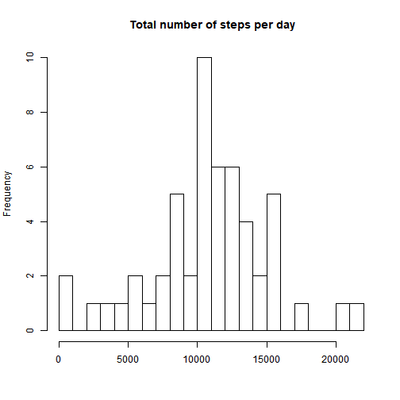
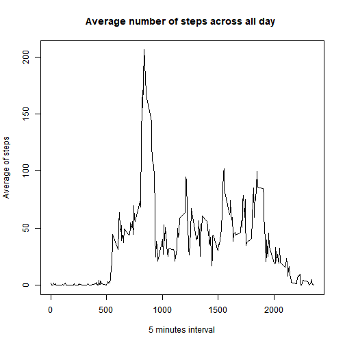
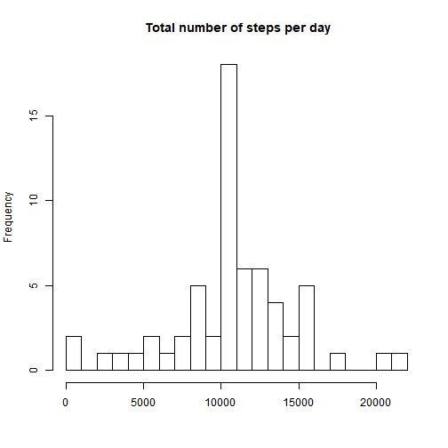
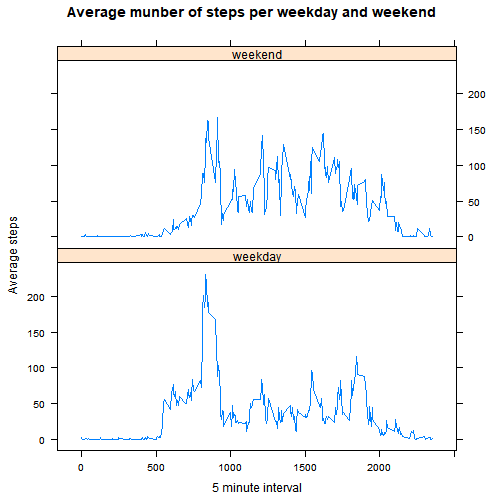

# Assignment 1

## Loading the data and pre processing data


```r
file = unzip("repdata_data_activity.zip")
dat = read.csv(file)
dat$date = as.Date( dat$date )
head( dat )
```

```
##   steps       date interval
## 1    NA 2012-10-01        0
## 2    NA 2012-10-01        5
## 3    NA 2012-10-01       10
## 4    NA 2012-10-01       15
## 5    NA 2012-10-01       20
## 6    NA 2012-10-01       25
```

## What is mean total number of steps taken per day?

Total number of steps

```r
totstep = aggregate(dat$steps ~ dat$date,data = dat,sum, na.rm = TRUE)
```

Histogram of total steps per day

```r
hist( totstep[[2]], 20, main = " Total number of steps per day", xlab = "" )
```



Mean of steps per day

```r
mean(totstep[[2]])
```

```
## [1] 10766.19
```
So, mean of number of steps per day is 10766.19

Median of steps per day

```r
median(totstep[[2]])
```

```
## [1] 10765
```

So, midean of number of steps per day is 10765

## What is the average daily activity pattern?

Average number of steps across all day

```r
avgact = aggregate(dat$steps ~ dat$interval, data=dat,mean, na.rm=TRUE)
plot(avgact$`dat$interval`,avgact$`dat$steps`,type = "l", xlab = "5 minutes interval", ylab = "Average of steps", main = "Average number of steps across all day ")
```



Which 5-minute interval contains maximum average


```r
avgact[avgact[[2]] == max(avgact[[2]]),]
```

```
##     dat$interval dat$steps
## 104          835  206.1698
```

The 835-th 5-minute interval contains the maximum number of steps.

## Imputing missing values

Number of missing values

```r
 sum(is.na(dat$steps))
```

```
## [1] 2304
```
There are 2304 missing values in the dataset.

Assign a value for NA

```r
newdat = dat
for(i in 1:length(newdat$steps)){
    if(is.na(newdat$steps[i]))
        newdat$steps[i]=avgact[newdat$interval[i]==avgact$`dat$interval`,][[2]]
}
head(newdat)
```

```
##       steps       date interval
## 1 1.7169811 2012-10-01        0
## 2 0.3396226 2012-10-01        5
## 3 0.1320755 2012-10-01       10
## 4 0.1509434 2012-10-01       15
## 5 0.0754717 2012-10-01       20
## 6 2.0943396 2012-10-01       25
```

```r
sum(is.na(newdat$steps))
```

```
## [1] 0
```
Total NAs is 0. So, no NAs.

Histogram of total steps for new dataset

```r
totstep1 = aggregate(newdat$steps ~ newdat$date,data = newdat,sum, na.rm = TRUE)
hist( totstep1[[2]], 20, main = " Total number of steps per day", xlab = "" )
```



Mean of steps per day

```r
mean(totstep1[[2]])
```

```
## [1] 10766.19
```
Mean is 10766.19


Median of steps per day

```r
median(totstep1[[2]])
```

```
## [1] 10766.19
```
Midean is  10766.19.

Mean and Median of initial dataset and mean and median of final dataset is almost equal. So, no difference between two datasets.

## Are there differences in activity patterns between weekdays and weekends?

Creating factor with two levels "weekday" and "weekend"


```r
newdat$week=weekdays(newdat$date)
for( i in 1:nrow(newdat)){
    if(newdat$week[i]=="Sunday"|newdat$week[i]=="Saturday") newdat$week[i]="weekend"
    else{ newdat$week[i]="weekday"
    }
}
newdat$week=as.factor(newdat$week)
class(newdat$week)
```

```
## [1] "factor"
```

```r
head(newdat)
```

```
##       steps       date interval    week
## 1 1.7169811 2012-10-01        0 weekday
## 2 0.3396226 2012-10-01        5 weekday
## 3 0.1320755 2012-10-01       10 weekday
## 4 0.1509434 2012-10-01       15 weekday
## 5 0.0754717 2012-10-01       20 weekday
## 6 2.0943396 2012-10-01       25 weekday
```
So, class of week variable is factor.

Panel plot of total steps across all weekday and weekwnd


```r
totstep2=aggregate(steps~interval+week, data = newdat, mean)
library(lattice)
xyplot(steps~interval|week, data = totstep2, type = "l", layout = c(1,2), main = "Average munber of steps per weekday and weekend", xlab = "5 minute interval", ylab = "Average steps")
```


